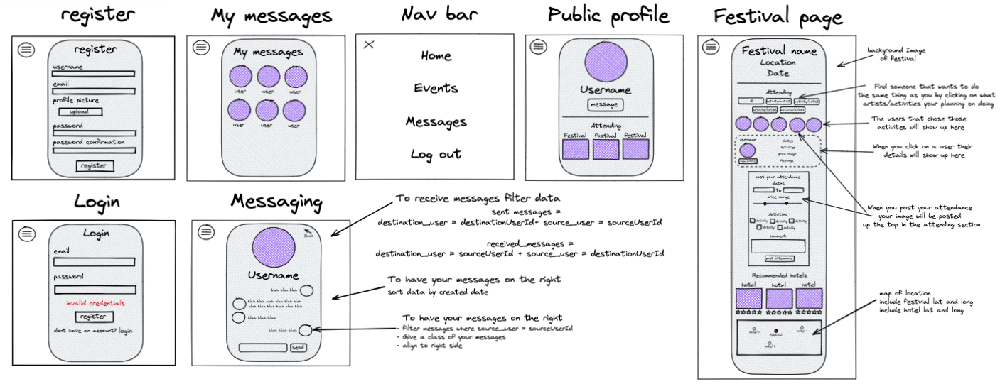
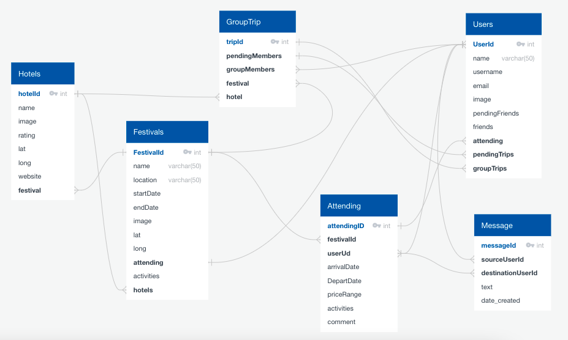

# Project 4

## Brief

To build a full stack application using a Python Django API and consuming our API with a separate front end using React.

## Timeframe

10 days

## Technologies Used

- Python
- Django
- PostgreSQl
- HTML
- CSS/Sass
- JavaScript
- React
- Axios
- Node.js

## My idea

The idea for my website came from a festival in Malta I had booked back in 2019. Due to covid, the festival had been postponed to 2022. All of my friends were unable to make the new dates, but I still wanted to go!

I must not be the only person this has happened to, and thought it would have been a good idea for the festival to put these people in touch so they can find other people to go with.

I created an app for festivals abroad, where you click attending to a festival, and post details about your trip such as dates flying out, and the activities/artists you want to go to there, eg. Castle rave/ pool party. Then people can find you and message you.

## Main features

- Messaging function (1 on 1 messaging)
- Festival page and "Attending" post
- Public Profile
- Register and login



I also wanted to add a "group trip" where you can create a trip and add other members you have met on the app. You can see it below in the group trip model. I decided not to include it as I didnt think it was possible within the time frame.



## Message function

### Back end

To get the messages between the user and user 2, I got user 2's ID from the parameter and named it **destination user ID**. The user ID is in the authorisation sent in the request.

```python
class getFriendsMessages(ListCreateAPIView):
    serializer_class = PopulatedMessageSerializer

    def get_queryset(self):
      queryset = Message.objects.all()
      destinationUserId = int(self.request.query_params.get('destinationUserId'))
      sourceUserId = self.request.user.id

      if destinationUserId:
        sent_messages = queryset.filter(destination_user=destinationUserId, source_user=sourceUserId)
      received_messages = queryset.filter(destination_user=sourceUserId, source_user=destinationUserId)
      all_messages = list(sent_messages) + list(received_messages)
      return all_messages
```

We then filter the messages that have been sent by user 1 to user 2 and from user 2 to user 1.

### Front end

In the front end when I call the API you can see how user 2's ID is added to the parameters (friendId) and we get the user 1 ID from the bearer token which is already set in session storage.

```javascript
export const getFriendsMessages = async (friendId) => {
  const options = {
    method: 'GET',
    url: `${baseUrl}/messages/?destinationUserId=${friendId}`,
    headers: {
      authorization: `Bearer ${window.sessionStorage.getItem('token')}`
    }
  };
  const { data } = await axios.request(options);
  return data;
};
```

When I come to use the data, I then sort it by created date.

```javascript
const messageData = await getFriendsMessages(id);
const sortedData = messageData.sort((a, b) =>
  a.created_date < b.created_date ? -1 : 1
);
setMessages(sortedData);
```

## Creating and sending a message

### Front end

Once you click send, we will await the send message request with **messageText** which includes the destination user ID (taken from the webpage parameters) and the message that was written.

I then reset the message template.

```javascript
const getData = async () => {
  try {
    await sendMessage(messageText);
  } catch (error) {
    console.log(error);
  }
};
getData();
setMessageText(messageTemplate);
setUpdate(!update);
```

To update the page to include the newly sent message I have also added setUpdate(!update) in the submit function. I then included [update] at the end of the React.useEffect function so that it will request the data again when I click submit.

## Festival page - user search function

On the festival page you can find other users that are interested in the same actvities by filtering the attending section, and then clicking the icon of any user to find out more.


To only get the activities personal to each festival, I mapped over the activities section on the festival data.

## Festival page - Post attendance


The hardest part of the post attendance form for me was the activities checkbox. I used map to get each of the activities for that particular festival and used **isChecked[index]** to tick and untick the boxes.

```javascript
const [isChecked, setIsChecked] = React.useState(
  new Array(attending.activities.length).fill(false)
);
```

```javascript
{
  singleFestival.activities.map((activity, index) => (
    <div key={activity} name='activites'>
      <input
        type='checkbox'
        id={activity}
        value={activity}
        checked={isChecked[index]}
        onChange={checkBox}
      />
      {activity}
    </div>
  ));
}
```

For the onChange I used the checkbox function. Firstly I uncheck/check the box -

```javascript
setIsChecked(!isChecked);
```

I then check if the activity is already on the list of activities in our post. If it hasnt, we spread our post data and add the activity to the list -

```javascript
if (!attending.activities.includes(activity)) {
  setAttending({
    ...attending,
    activities: [...attending.activities, activity]
  });
}
```

If it is already there, we need to remove it from the list -

```javascript
  else {
    setAttending({
      ...attending,
      activities: attending.activities.filter((a) => a !== activity)
    });
  }
```


## Future functionality

I would have loved to have had time to include the map of each festival location that includes the latitude and longitude of the festival and each hotel so users could see the place with the best location.
